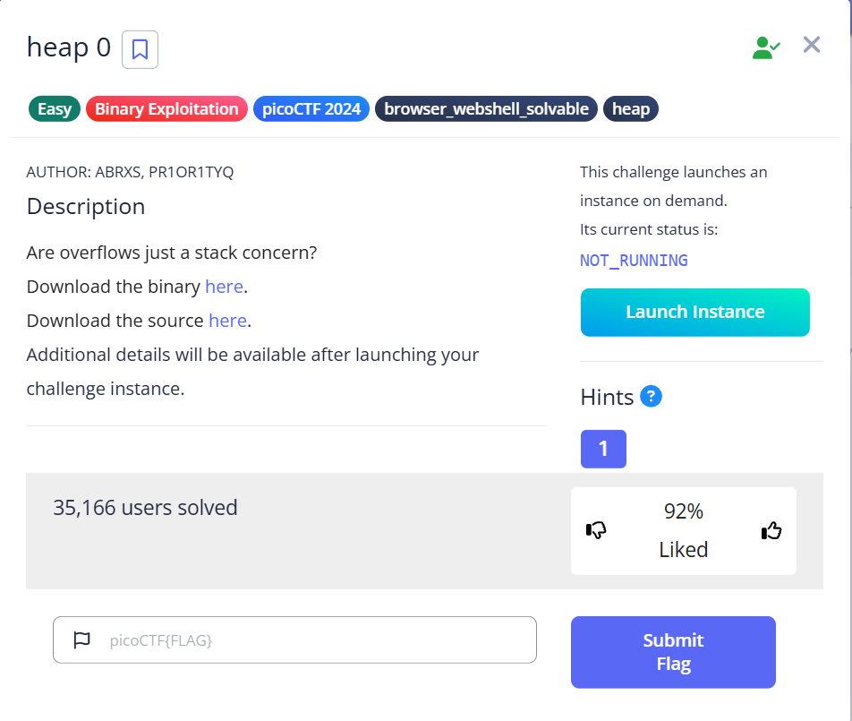
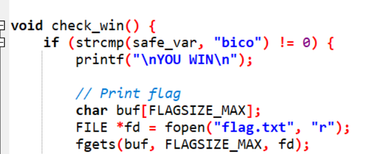
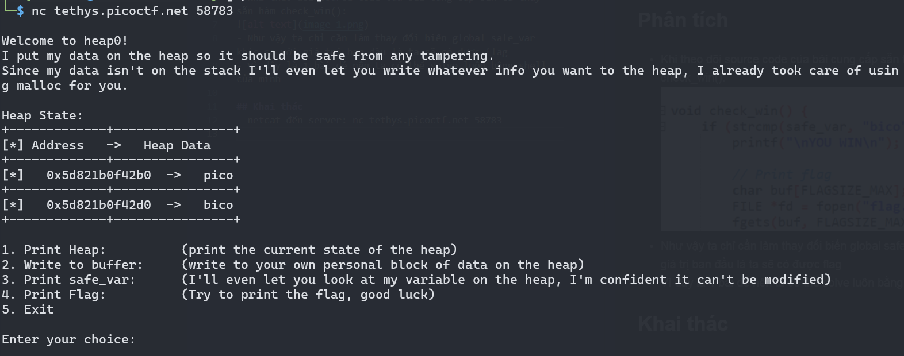
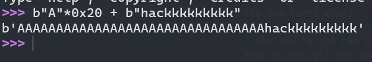
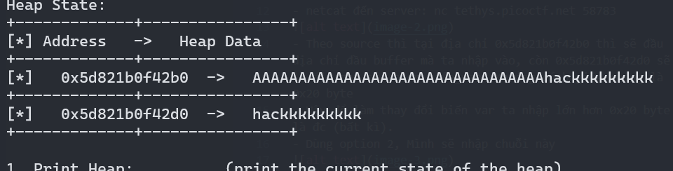
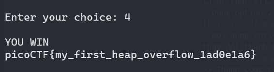

# *Challenge: heap 0*

***

## Phân tích
- Khi theo dõi source code của bài cung cấp sẵn ta thấy sẵn hàm check_win():

- Như vậy ta chỉ cần làm thay đổi biến global safe_var khác so với giá trị ban đầu là ta sẽ có được flag
- Vì đây là 1 bài dễ nên ta có thể solve luôn bằng shell của mình

## Khai thác
- netcat đến server: nc tethys.picoctf.net 58783

- Theo source thì tại địa chỉ 0x5d821b0f42b0 thì sẽ đầu địa chỉ đầu buffer mà ta nhập vào, còn 0x5d821b0f42d0 sẽ là địa chỉ của biến safe_var. Khoảng cách giữa chúng là 0x20 byte
- Vậy để làm thay đổi biến var ta nhập lớn hơn 0x20 byte là đc (bất kì).
- Dùng option 2, Mình sẽ nhập chuỗi này 

- Rồi dùng option 1 để kiểm tra xem địa chỉ sau có bị thay đổi thành hackkkkkkk như mình dự kiến ko.

-> Thành công rồi thì dùng option 4 lấy flag thôi:



## *Flag: ```picoCTF{my_first_heap_overflow_1ad0e1a6}```*